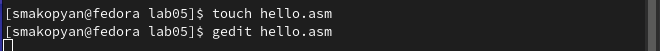

---
## Front matter
title: "Отчёта по лабораторной работе №5"
subtitle: "Создание и процесс обработки программ на языке ассемблера NASM"
author: "Акопян Сатеник Манвеловна"

## Generic otions
lang: ru-RU
toc-title: "Содержание"

## Bibliography
bibliography: bib/cite.bib
csl: pandoc/csl/gost-r-7-0-5-2008-numeric.csl

## Pdf output format
toc: true # Table of contents
toc-depth: 2
lof: true # List of figures
lot: true # List of tables
fontsize: 12pt
linestretch: 1.5
papersize: a4
documentclass: scrreprt
## I18n polyglossia
polyglossia-lang:
  name: russian
  options:
	- spelling=modern
	- babelshorthands=true
polyglossia-otherlangs:
  name: english
## I18n babel
babel-lang: russian
babel-otherlangs: english
## Fonts
mainfont: PT Serif
romanfont: PT Serif
sansfont: PT Sans
monofont: PT Mono
mainfontoptions: Ligatures=TeX
romanfontoptions: Ligatures=TeX
sansfontoptions: Ligatures=TeX,Scale=MatchLowercase
monofontoptions: Scale=MatchLowercase,Scale=0.9
## Biblatex
biblatex: true
biblio-style: "gost-numeric"
biblatexoptions:
  - parentracker=true
  - backend=biber
  - hyperref=auto
  - language=auto
  - autolang=other*
  - citestyle=gost-numeric
## Pandoc-crossref LaTeX customization
figureTitle: "Рис."
tableTitle: "Таблица"
listingTitle: "Листинг"
lofTitle: "Список иллюстраций"
lotTitle: "Список таблиц"
lolTitle: "Листинги"
## Misc options
indent: true
header-includes:
  - \usepackage{indentfirst}
  - \usepackage{float} # keep figures where there are in the text
  - \floatplacement{figure}{H} # keep figures where there are in the text
---

# Цель работы

Освоение процедуры компиляции и сборки программ, написанных на ассемблере NASM.

# Теоретическое введение

Основными функциональными элементами любой электронно-вычислительной
машины (ЭВМ) являются центральный процессор, память и периферийные
устройства 

Взаимодействие этих устройств осуществляется через общую шину, к которой
они подключены. Физически шина представляет собой большое количество про-
водников, соединяющих устройства друг с другом. В современных компьютерах
проводники выполнены в виде электропроводящих дорожек на материнской
(системной) плате.

Язык ассемблера (assembly language, сокращённо asm) — машинно-
ориентированный язык низкого уровня. Можно считать, что он больше любых
других языков приближен к архитектуре ЭВМ и её аппаратным возможностям,
что позволяет получить к ним более полный доступ, нежели в языках высокого
уровня, таких как C/C++, Perl, Python и пр. Заметим, что получить полный доступ
к ресурсам компьютера в современных архитектурах нельзя, самым низким
уровнем работы прикладной программы является обращение напрямую к ядру
операционной системы. Именно на этом уровне и работают программы, напи-
санные на ассемблере. Но в отличие от языков высокого уровня ассемблерная
программа содержит только тот код, который ввёл программист. Таким образом
язык ассемблера — это язык, с помощью которого понятным для человека
образом пишутся команды для процессора.

# Выполнение лабораторной работы

1.
 Создаём текстовый файл с именем hello.asm (рис. [-@fig:001])

{ #fig:001 width=70% }

2.
Открываем этот файл с помощью gedit (рис. [-@fig:002])

{ #fig:002 width=70% }

3.
 Вводим в него текст, данный в лабораторной работе (рис. [-@fig:003])

{ #fig:003 width=70% }

4.
 Компилируем текст программы "Hello world" (рис. [-@fig:004])

{ #fig:004 width=70% }

5.
 С помощью команды ls проверяем, что объектный файл был создан (рис. [-@fig:005]). Объектный файл имеет имя hello.o

{ #fig:005 width=70% }

6.
Скомпилируем исходный файл hello.asm в obj.o и с помощью команды ls проверяем, что файлы были созданы.(рис. [-@fig:006])

{ #fig:006 width=70% }

7.
Далее чтобы получить исполняемую программу, объектный файл необходимо передать на обработку компоновщику,с помощью команды ls проверяем что файл hello был создан. (рис. [-@fig:007])

{ #fig:007 width=70% }
 
8.
 Выполняем следующую команду, которая создаёт файл main (рис. [-@fig:008])

{ #fig:008 width=70% }

9.
 Запускаем на выполнение созданный исполняемый файл, находящийся в текущем каталоге (рис. [-@fig:009])

{ #fig:009 width=70% }

# Задание для самостоятельной работы

1.
В каталоге ~/work/arch-pc/lab05 с помощью команды cp создаем копию файла hello.asm с именем lab5.asm (рис. [-@fig:010])

{ #fig:010 width=70% }

2.
С помощью gedit вносим изменения в текст программы в файле lab5.asm так, чтобы вместо Hello world! на экран выводилась строка с моей фамилией и именем. (рис. [-@fig:011])

{ #fig:011 width=70% }

3.
Оттранслируем полученный текст программы lab5.asm в объектный файл. (рис. [-@fig:012]) (рис. [-@fig:013])

{ #fig:012 width=70% }

{ #fig:013 width=70% }

4.
Выполняем компоновку объектного файла и запустите получившийся исполняемый файл. (рис. [-@fig:014]) (рис. [-@fig:015]) (рис. [-@fig:016])

{ #fig:014 width=70% }

{ #fig:015 width=70% }

{ #fig:016 width=70% }

5.
Копируем файлы hello.asm и lab5.asm в локальный репозиторий в каталог ~/work/study 2022-2023/"Архитектура компьютера"/arch-pc/labs/lab05/. Загружаем файлы на github (рис. [-@fig:017])

{ #fig:017 width=70% }

# Выводы

В результате данной лабораторной работы я освоила процедуры компиляции и сборки программ, написанных на ассемблере NASM.

# Список литературы{.unnumbered}

::: {#refs}
:::
