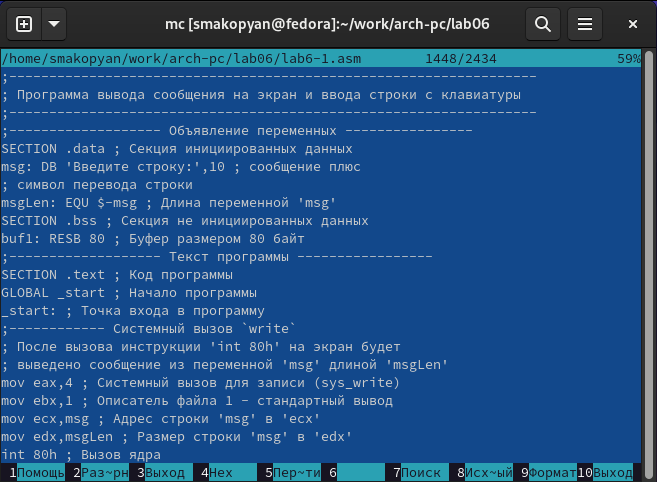
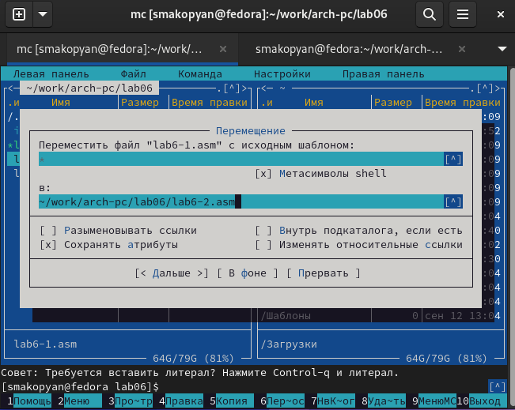

---
## Front matter
title: "Отчёта по лабораторной работе №6"
subtitle: "Лабораторная работа №6. Основы работы с
Midnight Commander (mc). Структура
программы на языке ассемблера NASM.
Системные вызовы в ОС GNU Linux"
author: "Акопян Сатеник Манвеловна"

## Generic otions
lang: ru-RU
toc-title: "Содержание"

## Bibliography
bibliography: bib/cite.bib
csl: pandoc/csl/gost-r-7-0-5-2008-numeric.csl

## Pdf output format
toc: true # Table of contents
toc-depth: 2
lof: true # List of figures
lot: true # List of tables
fontsize: 12pt
linestretch: 1.5
papersize: a4
documentclass: scrreprt
## I18n polyglossia
polyglossia-lang:
  name: russian
  options:
	- spelling=modern
	- babelshorthands=true
polyglossia-otherlangs:
  name: english
## I18n babel
babel-lang: russian
babel-otherlangs: english
## Fonts
mainfont: PT Serif
romanfont: PT Serif
sansfont: PT Sans
monofont: PT Mono
mainfontoptions: Ligatures=TeX
romanfontoptions: Ligatures=TeX
sansfontoptions: Ligatures=TeX,Scale=MatchLowercase
monofontoptions: Scale=MatchLowercase,Scale=0.9
## Biblatex
biblatex: true
biblio-style: "gost-numeric"
biblatexoptions:
  - parentracker=true
  - backend=biber
  - hyperref=auto
  - language=auto
  - autolang=other*
  - citestyle=gost-numeric
## Pandoc-crossref LaTeX customization
figureTitle: "Рис."
tableTitle: "Таблица"
listingTitle: "Листинг"
lofTitle: "Список иллюстраций"
lotTitle: "Список таблиц"
lolTitle: "Листинги"
## Misc options
indent: true
header-includes:
  - \usepackage{indentfirst}
  - \usepackage{float} # keep figures where there are in the text
  - \floatplacement{figure}{H} # keep figures where there are in the text
---

# Цель работы

Приобретение практических навыков работы в Midnight Commander. Освоение
инструкций языка ассемблера mov и int.

# Теоретическое введение

Midnight Commander (или просто mc) — это программа, которая позволяет
просматривать структуру каталогов и выполнять основные операции по управ-
лению файловой системой, т.е. mc является файловым менеджером. Midnight
Commander позволяет сделать работу с файлами более удобной и наглядной.
Для активации оболочки Midnight Commander достаточно ввести в командной
строке mc и нажать клавишу Enter

# Выполнение лабораторной работы

1.
Открываем Midnight Commander (рис. [-@fig:001])

{ #fig:001 width=70% }

2.
Переходим в каталог ~/work/arch-pc с помощью функциональной клавиши F7 создаём папку lab06 и переходим в созданный каталог (рис. [-@fig:002])

{ #fig:002 width=70% }

3.
Пользуясь строкой ввода и командой touch создаём файл lab6-1.asm (рис. [-@fig:003])

{ #fig:003 width=70% }

4.
С помощью функциональной клавиши F4 открываем файл lab6-1.asm, вводим текст программы сохраняем изменения и закрываем файл. (рис. [-@fig:004])

{ #fig:004 width=70% }

5.
С помощью функциональной клавиши F3 открывем файл lab6-1.asm для просмотра. Убеждаемся, что файл содержит текст программы. (рис. [-@fig:005]). 

{ #fig:005 width=70% }

6.
Оттранслируем текст программы lab6-1.asm в объектный файл. Выполняем компоновку объектного файла и запускаем получившийся исполняемый файл. Программа выводит строку 'Введите строку:' и ожидает ввода с
клавиатуры. [-@fig:006]) (рис. [-@fig:007])

{ #fig:006 width=70% }

{ #fig:007 width=70% }

7.
Скачиваем файл in_out.asm со страницы курса в ТУИС. (рис. [-@fig:008])

{ #fig:008 width=70% }

8.
В одной из панелей mc откройте каталог с файлом lab6-1.asm. В другой панели каталог со скаченным файлом in_out.asm (рис. [-@fig:009])

{ #fig:009 width=70% }

9.
С помощью функциональной клавиши F6 создаём копию файла lab6-1.asm с именем lab6-2.asm.(рис [-@fig:010])

{ #fig:010 width=70% }

10.
Исправим текст программы в файле lab6-2.asm с использование подпрограмм из внешнего файла in_out.asm (рис. [-@fig:011])

{ #fig:011 width=70% }

11.
Создаем исполняемый файл и проверяем его работу (рис. [-@fig:012]) 

{ #fig:012 width=70% }

12.
Меняем подпрограмму sprintLF на sprint. Создаём исполняемый файл и проверяем его работу (рис. [-@fig:013]) (рис. [-@fig:014]). Отличие лишь в том, что с помощью подпрограммы sprintLF сообщение печатается с новой строки.

{ #fig:013 width=70% }

{ #fig:014 width=70% }

# Задание для самостоятельной работы

1.
Создаем копию файла lab6-1.asm под названием lab6-1с.asm и вносим изменения так, как чтобы программа работала по алгоритму, описанному в лабораторной работе (рис. [-@fig:015])

{ #fig:015 width=70% }

2.
Создаем исполняемый файл и проверяем его работу (рис. [-@fig:016])

{ #fig:016 width=70% }

3.
Создаем копию файла lab6-2.asm под названием lab6-2с.asm и вносим изменения с использованием подпрограмм из внешнего файла in_out.asm так, чтобы программа работала по алгоритму, описанному в лабораторной работе (рис. [-@fig:017])

{ #fig:017 width=70% }

4.
Создаем исполняемый файл и проверяем его работу (рис. [-@fig:018])

{ #fig:018 width=70% }
# Выводы

В результате данной лабораторной работы я приобрела практические навыки работы в Midnight Commander, освоила инструкции языка ассемблера mov и int.

# Список литературы{.unnumbered}

::: {#refs}
:::
