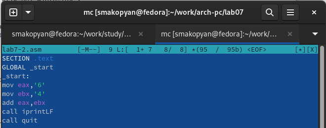
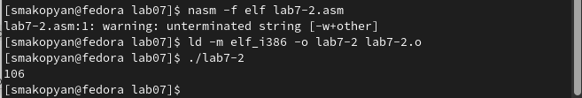
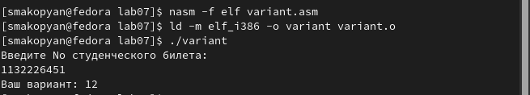

---
## Front matter
title: "Отчет по лабораторной работе №7"
subtitle: "Арифметические
операции в NASM"
author: "Акопян Сатеник"

## Generic otions
lang: ru-RU
toc-title: "Содержание"

## Bibliography
bibliography: bib/cite.bib
csl: pandoc/csl/gost-r-7-0-5-2008-numeric.csl

## Pdf output format
toc: true # Table of contents
toc-depth: 2
lof: true # List of figures
lot: true # List of tables
fontsize: 12pt
linestretch: 1.5
papersize: a4
documentclass: scrreprt
## I18n polyglossia
polyglossia-lang:
  name: russian
  options:
	- spelling=modern
	- babelshorthands=true
polyglossia-otherlangs:
  name: english
## I18n babel
babel-lang: russian
babel-otherlangs: english
## Fonts
mainfont: PT Serif
romanfont: PT Serif
sansfont: PT Sans
monofont: PT Mono
mainfontoptions: Ligatures=TeX
romanfontoptions: Ligatures=TeX
sansfontoptions: Ligatures=TeX,Scale=MatchLowercase
monofontoptions: Scale=MatchLowercase,Scale=0.9
## Biblatex
biblatex: true
biblio-style: "gost-numeric"
biblatexoptions:
  - parentracker=true
  - backend=biber
  - hyperref=auto
  - language=auto
  - autolang=other*
  - citestyle=gost-numeric
## Pandoc-crossref LaTeX customization
figureTitle: "Рис."
tableTitle: "Таблица"
listingTitle: "Листинг"
lofTitle: "Список иллюстраций"
lotTitle: "Список таблиц"
lolTitle: "Листинги"
## Misc options
indent: true
header-includes:
  - \usepackage{indentfirst}
  - \usepackage{float} # keep figures where there are in the text
  - \floatplacement{figure}{H} # keep figures where there are in the text
---

# Цель работы

Освоение арифметических инструкций языка ассемблера NASM

# Теоретическое введение

Большинство инструкций на языке ассемблера требуют обработки операндов.
Адрес операнда предоставляет место, где хранятся данные, подлежащие обра-
ботке. Это могут быть данные хранящиеся в регистре или в ячейке памяти. Далее
рассмотрены все существующие способы задания адреса хранения операндов –
способы адресации.
Существует три основных способа адресации:
-Регистровая адресация – операнды хранятся в регистрах и в команде
используются имена этих регистров, например: mov ax,bx.
-Непосредственная адресация – значение операнда задается непосред-
ственно в команде, Например: mov ax,2.
-Адресация памяти – операнд задает адрес в памяти. В команде указывает-
ся символическое обозначение ячейки памяти, над содержимым которой
требуется выполнить операцию.# Выполнение лабораторной работы

# Выполнение работы

1.
Создаем каталог для программ лабораторной работы № 7, переходим в него и создаем файл lab7-1.asm (рис. [-@fig:001])

{ #fig:001 width=70% }

2.
Вводим в файл lab7-1.asm текст программы из листинга, представленного в лабораторной работе (рис. [-@fig:002])

{ #fig:002 width=70% }

3.
Создаем исполняемый файл и запускаем его, предварительно скопировав подключаемый файл in_out.asm в каталог с текстом программы (рис. [-@fig:003])

{ #fig:003 width=70% }

4.
Изменим текст программы и вместо символов запишем в регистры числа (рис. [-@fig:004])

{ #fig:004 width=70% }

5.
Создадим исполняемый файл и запустим его (рис. [-@fig:005]). 

{ #fig:005 width=70% }

Пользуясь таблицей ASCII, определяем что код 10 соответствует символу перевода на новую строку, что является причиной того, почему данный символ вывел на экран только 2 пустые строки.

6.
Создаем файл lab7-2.asm в каталоге ~/work/arch-pc/lab07 (рис. [-@fig:006]) 

{ #fig:006 width=70% }

7.
Вводим в созданный файл текст программы из листинга 7.2, представленного в лабораторной работе (рис. [-@fig:007]) 

{ #fig:007 width=70% }

8.Создаем исполняемый файл и запускаем его (рис. [-@fig:008])

{ #fig:008 width=70% }

9.
Аналогично предыдущему примеру изменим символы на числа. (рис. [-@fig:009])

{ #fig:009 width=70% }

10.
Создаем исполняемый файл и запускаем его (рис. [-@fig:010])

{ #fig:010 width=70% }

11.
Меняем функцию iprintLF на iprint. Создаем исполняемый файл и запускаем его. (рис. [-@fig:011])

{ #fig:011 width=70% }

Нетрудно заметить, что после проведенных действий изменилось только то, что следующая строка после вывода программы, начинается с текущей.

12.
Создаем файл lab7-3.asm в каталоге ~/work/arch-pc/lab07 и вводим в него текст программы из листинга, данного в лабораторной работе (рис. [-@fig:012]) 

{ #fig:012 width=70% }

13.
Создаем исполняемый файл и запускаем его (рис. [-@fig:013]) 

{ #fig:013 width=70% }

14.
Изменим текст программы для вычисления выражения $/f(x)=(4*6+2)/5$ (рис. [-@fig:014]), создадим исполняемый файл и проверим его работу (рис. [-@fig:015])

{ #fig:014 width=70% }

{ #fig:015 width=70% }

15.
Создаем файл variant.asm в каталоге ~/work/arch-pc/lab07 (рис. [-@fig:016]), и вводим в него текст, представленный в лабораторной работе (рис. [-@fig:017])

{ #fig:016 width=70% }

{ #fig:017 width=70% }

16.
Создаем исполняемый файл и запускаем его (рис. [-@fig:018])

{ #fig:018 width=70% }

# Задание для самостоятельной работы

Вариант 12.

1.
Создаем файл, в котором запишем текст программы (рис. [-@fig:019])

{ #fig:019 width=70% }

2.
Вводим текст программы в созданный файл (рис. [-@fig:020])

{ #fig:020 width=70% }

3.
Создаемый исполняемый файл и проверяем его работу для значений 1 и 5 (рис. [-@fig:021])

{ #fig:021 width=70% }

# Выводы

В результате данной лабораторной работы я освоила арифметические инструкции языка ассемблера NASM.

# Список литературы{.unnumbered}

::: {#refs}
:::
